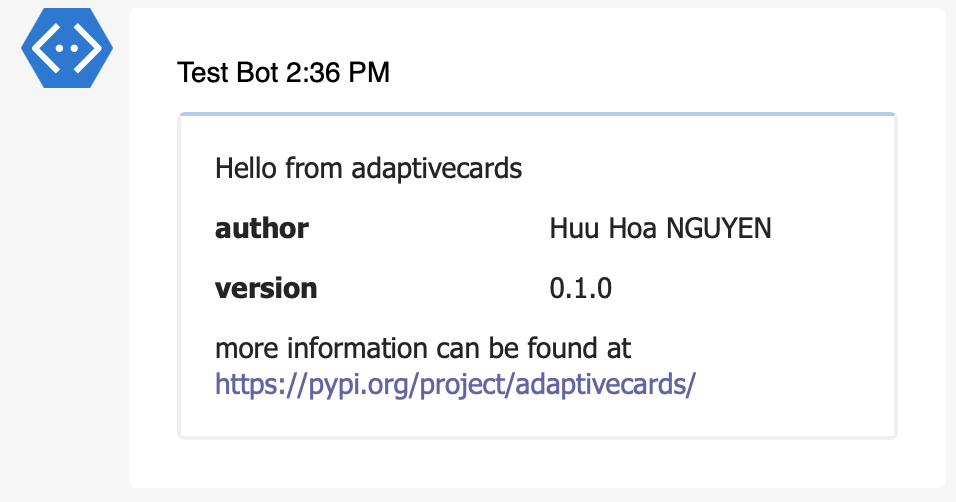

# AdaptiveCards

*Author adaptive cards in pure python*


## Introduction 

[Adaptive Cards](https://adaptivecards.io/) are a great way to extend your bot interactions. However, writing the JSON required to specify the card layout by hand can be cumbersome and error prone. And while using a [designer](https://adaptivecards.io/designer/) is a good way to manually create cards this does not cover cards that are generated by code. AdaptiveCards allows you to author cards in native python without ever touching the underlying json.

A code sample says more then a thousand words so the following code snippet ...

```python
from adaptivecards.adaptivecard import AdaptiveCard
from adaptivecards.elements import TextBlock
from adaptivecards.containers import Column, ColumnSet, Container

card = AdaptiveCard()
card.body = [
    Container(items=[
        TextBlock(text='Hello from adaptivecards', font_type='Default', size='Medium'),
        ColumnSet(columns=[
            Column(
                width='stretch',
                items=[
                    TextBlock(text='author', weight="Bolder", wrap=True),
                    TextBlock(text='version', weight="Bolder", wrap=True),
                ]
            ),
            Column(
                width='stretch',
                items=[
                    TextBlock(text='Huu Hoa NGUYEN', wrap=True),
                    TextBlock(text='0.1.0', wrap=True),
                ]
            )
        ])
    ]),
    TextBlock(text='more information can be found at [https://pypi.org/project/adaptivecards/](https://pypi.org/project/adaptivecards/)',
              wrap=True)
]
json_str = str(card)
print(json_str)
```

... produces this json ...

```json
{
  "$schema": "http://adaptivecards.io/schemas/adaptive-card.json",
  "body": [
    {
      "items": [
        {
          "fontType": "Default",
          "size": "Medium",
          "text": "Hello from adaptivecards",
          "type": "TextBlock"
        },
        {
          "columns": [
            {
              "items": [
                {
                  "text": "author",
                  "type": "TextBlock",
                  "weight": "Bolder",
                  "wrap": true
                },
                {
                  "text": "version",
                  "type": "TextBlock",
                  "weight": "Bolder",
                  "wrap": true
                }
              ],
              "type": "Column",
              "width": "stretch"
            },
            {
              "items": [
                {
                  "text": "Huu Hoa NGUYEN",
                  "type": "TextBlock",
                  "wrap": true
                },
                {
                  "text": "0.1.0",
                  "type": "TextBlock",
                  "wrap": true
                }
              ],
              "type": "Column",
              "width": "stretch"
            }
          ],
          "type": "ColumnSet"
        }
      ],
      "type": "Container"
    },
    {
      "text": "more information can be found at [https://pypi.org/project/adaptivecards/](https://pypi.org/project/adaptivecards/)",
      "type": "TextBlock",
      "wrap": true
    }
  ],
  "type": "AdaptiveCard",
  "version": "1.2"
}
```

when render in Teams will look like


## Features

- Supports all components, options and features of adaptive cards version 1.4
- Create adaptive cards from pure python

## Installation

You can install AdaptiveCards using pip by issuing

```bash
$ pip install adaptivecards
```

For more information on how to use this package please check the project documentation at https://github.com/huuhoa/adaptivecards.

## Authors & Maintainers

- Huu Hoa NGUYEN <huuhoa@gmail.com>

## Credits

The following resources were influential in the creation of this project:

- The package's README was copied partially from [PyAdaptiveCards](https://github.com/CiscoSE/pyadaptivecards)

## License

This project is licensed to you under the terms of the [MIT License](./LICENSE).
